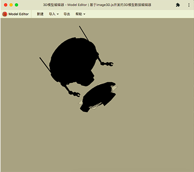

<p>
    
</p>

# [Model Editor](https://hai2007.github.io/model-editor/) - 基于image3D.js开发的3D模型数据编辑器。

<p>
    
</p>

## Issues
使用的时候遇到任何问题或有好的建议，请点击进入[issue](https://github.com/hai2007/model-editor/issues)，欢迎参与维护！

## How to use?

首先，你需要安装依赖：

```
npm install
```

开发的时候运行下列命令：

```
npm run dev
```

开发完毕需要发布的时候，请运行下列命令：

```
npm run build
```

开源协议
---------------------------------------
[MIT](https://github.com/hai2007/model-editor/blob/master/LICENSE)

Copyright (c) 2022 [hai2007](https://hai2007.gitee.io/sweethome/) 走一步，再走一步。
